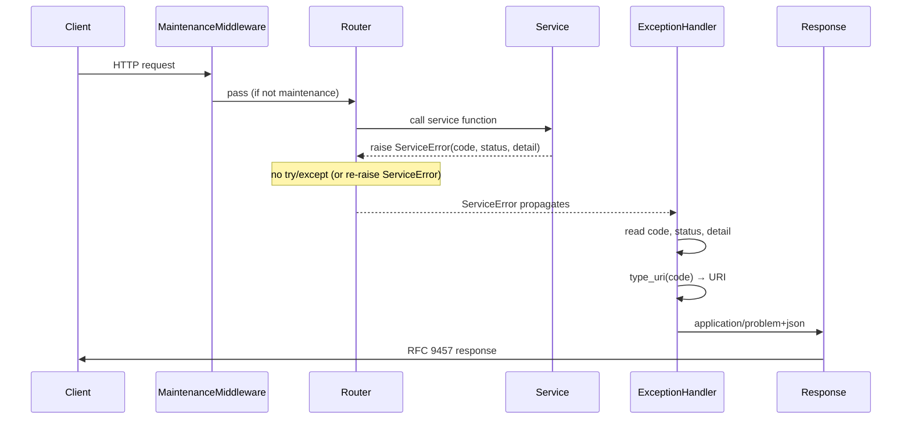
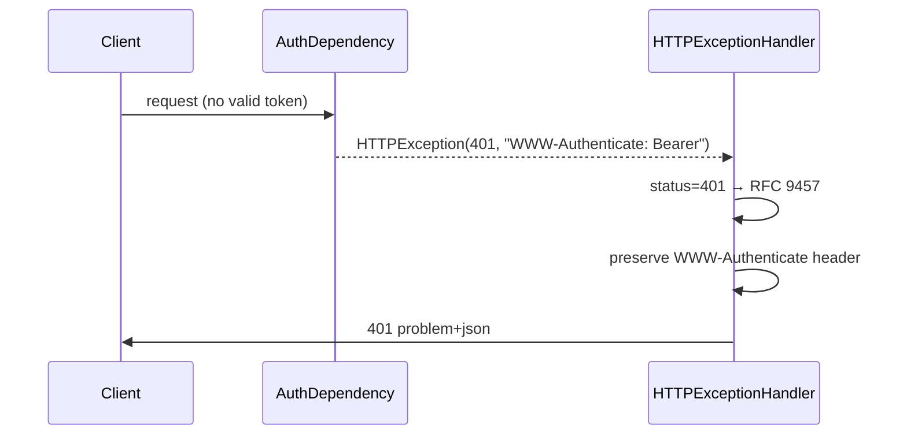

# Design: Normalize Error Responses (RFC 9457)

## Technical Approach

Three global FastAPI exception handlers in `utils/errors.py` (imported by `main.py`) catch `ServiceError`, `HTTPException` (auth only), and `RequestValidationError`. All produce `application/problem+json` per RFC 9457. A `type_uri(code)` utility derives the `type` field from domain exception codes.

**Critical design constraint**: Routers currently catch `ServiceError` → raise `HTTPException`. For the `ServiceError` handler to capture domain `code` for the `type` URI, router catch blocks must be replaced with `raise e` (re-raise the ServiceError) or removed entirely. This is a **mechanical change** — zero logic is modified, only the wrapping layer is stripped. The cart's 400 override uses `raise InsufficientStockError(e.detail, status_code=400)` to pass the overridden status to the handler.

**Service constructor patch (Option A)**: The current `InsufficientStockError.__init__` hardcodes `status_code=409` and `code="insufficient_stock"`. To support the cart 400 override, the constructor is extended to accept both as optional keyword args with the original values as defaults:

```python
class InsufficientStockError(ServiceError):
    def __init__(
        self,
        detail: str = "Stock insuficiente.",
        *,
        status_code: int = 409,
        code: str = "insufficient_stock",
    ) -> None:
        super().__init__(detail, status_code=status_code, code=code)
```

Backward compatible — all other call sites keep defaulting to 409. This is a 3-line patch to `services/exceptions.py`, not a service refactor.

## Architecture Overview





### Handler Registration Order

FastAPI checks handlers in registration order. Register `ServiceError` first, then `HTTPException`, then `RequestValidationError`. Starlette's `ExceptionMiddleware` matches the first compatible handler.

## Component Design

### Decision: Handler File Location

**Choice**: `utils/errors.py` (new module)
**Alternatives**: inline in `main.py`, `middleware/problem_details.py`
**Rationale**: `main.py` is already 238 lines of app config, lifespan, middleware, and router mounting. A dedicated module keeps handlers testable in isolation without importing the full app. `main.py` only imports and registers them.

### 1. `type_uri()` Utility

**File**: `utils/errors.py`
**Signature**: `def type_uri(code: str, base_url: str | None = None) -> str`

**Algorithm**:
1. Guard: if `code` is empty/None → return `"about:blank"`
2. Slugify: `code.replace("_", "-").lower()`
3. Strip non-URL-safe chars: keep `[a-z0-9\-]` only
4. If slugified result is empty → `"about:blank"`
5. `base_url` defaults to `https://api.altotrago.com/errors` (configurable via `settings.ERROR_TYPE_BASE_URL` or env var)
6. Return `f"{base_url}/{slug}"`

**Edge cases**:
| Input | Output |
|-------|--------|
| `"insufficient_stock"` | `.../insufficient-stock` |
| `"invalid_object_id"` | `.../invalid-object-id` |
| `"conflict"` | `.../conflict` |
| `""` | `about:blank` |
| `None` | `about:blank` |
| `"café_error"` | `.../caf-error` |

**Spec scenarios**: `type_uri("insufficient_stock")` → hyphenated, `type_uri("invalid_object_id")` → hyphenated, `type_uri("conflict")` → single-word.

### 2. `ServiceError` Handler

**File**: `utils/errors.py`
**Registration**: `app.add_exception_handler(ServiceError, service_error_handler)` in `main.py`

**Pseudocode**:
```python
async def service_error_handler(request: Request, exc: ServiceError) -> JSONResponse:
    return JSONResponse(
        status_code=exc.status_code,
        content={
            "type": type_uri(exc.code),
            "title": HTTP_STATUS_PHRASES.get(exc.status_code, "Unknown"),
            "status": exc.status_code,
            "detail": exc.detail,
            "instance": request.url.path,
        },
        headers={"Content-Type": "application/problem+json"},
    )
```

`HTTP_STATUS_PHRASES` is a dict mapping `{400: "Bad Request", 404: "Not Found", ...}` sourced from Python's `http.HTTPStatus`.

**Edge cases**:
- Cart 400: handler reads `exc.status_code` (400, not 409) — preserved via router re-raise: `raise InsufficientStockError(e.detail, status_code=400)`. **Requires the constructor patch documented in the Technical Approach section** — without it, the call fails with `TypeError: unexpected keyword argument 'status_code'`.
- `InternalError` (500): `type` URI derived from `"internal_error"` code, not stack trace
- Unknown status_code → "Unknown" title fallback
- Missing `detail` attribute → `"An error occurred"` fallback

**Spec scenarios**: NotFoundError→404, ValidationError→400, InsufficientStockError→409, ForbiddenError→403, InternalError→500, Cart→400, Instance from path.

### 3. `HTTPException` Handler (Auth)

**File**: `utils/errors.py`
**Registration**: `app.add_exception_handler(HTTPException, http_exception_handler)` in `main.py`

**Pseudocode**:
```python
async def http_exception_handler(request: Request, exc: HTTPException) -> JSONResponse:
    # Exclusion: admin and age-verification pass through
    if request.url.path.startswith(("/admin", "/age-verification")):
        raise exc  # let default FastAPI handler process it

    # Only normalize 401/403
    if exc.status_code not in (401, 403):
        raise exc  # pass through to FastAPI default

    response = JSONResponse(
        status_code=exc.status_code,
        content={
            "type": "about:blank",
            "title": HTTP_STATUS_PHRASES.get(exc.status_code, "Unauthorized"),
            "status": exc.status_code,
            "detail": exc.detail,
            "instance": request.url.path,
        },
        headers={"Content-Type": "application/problem+json"},
    )

    # Preserve WWW-Authenticate header from original exception
    if exc.headers:
        for key, value in exc.headers.items():
            response.headers[key] = value

    return response
```

**Edge cases**:
- Admin/age-verification: handler calls `raise exc` (re-raises) — FastAPI's `ServerErrorMiddleware` catches it with default behavior
- Non-auth 400/404/etc.: `raise exc` pass-through — existing behavior preserved
- `WWW-Authenticate` header preservation: copied from `exc.headers` to `JSONResponse.headers`
- Missing `exc.detail` → `""` fallback

**Spec scenarios**: 401→RFC 9457, 403→RFC 9457, 401 preserves WWW-Authenticate, non-auth pass-through, admin not normalized.

### 4. `RequestValidationError` Handler (Pydantic)

**File**: `utils/errors.py`
**Registration**: `app.add_exception_handler(RequestValidationError, validation_exception_handler)` in `main.py`

**Pseudocode**:
```python
from fastapi.exceptions import RequestValidationError
from typing import Any

def _loc_to_pointer(loc: tuple[str | int, ...]) -> str:
    """Convert Pydantic loc tuple to RFC 6901 JSON Pointer."""
    parts: list[str] = []
    for item in loc:
        if isinstance(item, int):
            parts.append(str(item))
        else:
            parts.append(item)
    return "/" + "/".join(parts)

async def validation_exception_handler(
    request: Request, exc: RequestValidationError
) -> JSONResponse:
    errors: list[dict[str, Any]] = []
    for error in exc.errors():
        errors.append({
            "pointer": _loc_to_pointer(error.get("loc", tuple())),
            "detail": error.get("msg", "Validation error"),
            "code": error.get("type", "validation_error"),
        })

    return JSONResponse(
        status_code=422,
        content={
            "type": "about:blank",
            "title": "Unprocessable Entity",
            "status": 422,
            "detail": "Request validation failed",
            "instance": request.url.path,
            "errors": errors,
        },
        headers={"Content-Type": "application/problem+json"},
    )
```

**Edge cases**:
- `loc` tuple `("body", "product_id")` → `"/body/product_id"`
- `loc` tuple `("body", 0, "items")` → `"/body/0/items"` (array index)
- Empty `loc` tuple → `"/"`
- `errors` array always present even for single-field errors
- `code` uses Pydantic's `type` field (e.g., `"missing"`, `"type_error.integer"`)

**Spec scenarios**: single field error, multiple field errors, Content-Type correct.

## Data Flow: Representative Responses

### Scenario 1: NotFoundError (product not found)

```
Client → GET /products/abc123
Router → services.get_product(db, "abc123")
Service → raise ProductNotFoundError("Producto no encontrado.")
Handler → service_error_handler
Response → 404 application/problem+json
```

```json
{
  "type": "https://api.altotrago.com/errors/not-found",
  "title": "Not Found",
  "status": 404,
  "detail": "Producto no encontrado.",
  "instance": "/products/abc123"
}
```

### Scenario 2: InsufficientStock (cart, 400 override)

```
Client → POST /cart/add
Router → cart service raises InsufficientStockError
Router → raises InsufficientStockError(detail, status_code=400)  [re-raise with override]
Handler → reads status_code=400, code="insufficient_stock"
Response → 400 application/problem+json
```

```json
{
  "type": "https://api.altotrago.com/errors/insufficient-stock",
  "title": "Bad Request",
  "status": 400,
  "detail": "Stock insuficiente para el producto 'Stella Artois 1L'. Solo quedan 2 unidades y pediste 5.",
  "instance": "/cart/add"
}
```

### Scenario 3: Pydantic validation (missing field)

```
Client → POST /products/{}  (empty body)
FastAPI body parser → RequestValidationError
Handler → validation_exception_handler
Response → 422 application/problem+json
```

```json
{
  "type": "about:blank",
  "title": "Unprocessable Entity",
  "status": 422,
  "detail": "Request validation failed",
  "instance": "/products/",
  "errors": [
    {
      "pointer": "/body/name",
      "detail": "field required",
      "code": "missing"
    }
  ]
}
```

## File Structure

| File | Action | Purpose | Est. LOC | Key symbols |
|------|--------|---------|----------|-------------|
| `utils/errors.py` | **Create** | All 3 handlers + `type_uri()` + `_loc_to_pointer()` | ~80 | `type_uri`, `service_error_handler`, `http_exception_handler`, `validation_exception_handler`, `_loc_to_pointer` |
| `utils/__init__.py` | **Create** | Package init (empty or re-export) | ~2 | — |
| `main.py` | **Modify** | Import + register 3 handlers via `add_exception_handler` | +15 | — |
| `routers/cart.py` | **Modify** | Change `HTTPException(400)` → `raise InsufficientStockError(status_code=400)` (requires constructor patch) | ~4 changed lines | Lines 71-73, 101-103 |
| `services/exceptions.py` | **Modify** | Patch `InsufficientStockError.__init__` to accept `status_code` and `code` as optional kwargs (3-line patch) | +3 | Lines 105-109 |
| `routers/products.py` | **Modify** | Remove try/except blocks that wrap ServiceError → HTTPException | ~10 removed lines | Lines 33-36, 95-96, 123-124, 147-148, 175-176 |
| `routers/orders.py` | **Modify** | Remove try/except blocks (8 blocks) | ~16 removed lines | Lines 66-81, 122-126, 149-151, 177-178 |
| `routers/inventory.py` | **Modify** | Remove try/except blocks (2 blocks) | ~4 removed lines | Lines 44-45, 69-70 |
| `routers/payments.py` | **Modify** | Remove try/except blocks (4 blocks) | ~8 removed lines | Lines 35-41 |
| `routers/combos.py` | **Modify** | Remove try/except blocks for ServiceError | ~10 removed lines | Lines 116-120, 151-153, 185-186 |
| `routers/pricing_settings.py` | **Modify** | Remove try/except blocks (3 blocks) | ~6 removed lines | Lines 32-33, 57-58, 93-94 |
| `tests/unit/test_problem_details.py` | **Create** | Unit tests for `type_uri()`, handler functions | ~100 | 12-15 tests |
| `tests/integration/test_normalized_errors.py` | **Create** | Integration tests via TestClient | ~150 | 10-12 tests |

### NOT touched (explicitly excluded)

| File | Reason |
|------|--------|
| `services/cart.py` | Unchanged — raises exceptions as before |
| `services/orders_helpers.py` | Unchanged |
| `routers/admin.py` | Excluded — own exception handling preserved |
| `routers/age_verification.py` | Excluded — HTTPException handler passes through |
| `routers/auth.py` | Unchanged — DuplicateKeyError pass-through stays |
| `security.py` | Unchanged — raises HTTPException(401/403) directly, caught by HTTPException handler |

## Testing Strategy

### Test Pyramid

| Layer | What | Tests | File |
|-------|------|-------|------|
| Unit | `type_uri()` — 8 edge cases | 8 | `tests/unit/test_problem_details.py` |
| Unit | `_loc_to_pointer()` — 5 cases | 5 | `tests/unit/test_problem_details.py` |
| Unit | `service_error_handler` — mock Request + 7 exception families | 7 | `tests/unit/test_problem_details.py` |
| Unit | `http_exception_handler` — 401, 403, non-auth pass-through, admin exclusion, WWW-Authenticate | 5 | `tests/unit/test_problem_details.py` |
| Unit | `validation_exception_handler` — single error, multi-error, loc→pointer | 3 | `tests/unit/test_problem_details.py` |
| Integration | Full HTTP round-trip: NotFound, InsufficientStock, Pydantic validation, auth 401/403 | 6 | `tests/integration/test_normalized_errors.py` |

**Total new tests**: ~34 (28 unit + 6 integration)

### Existing Tests — Impact Analysis

All 48 existing tests use `test_app` (conftest.py), which creates a **fresh FastAPI instance without exception handlers**. Zero existing tests break.

Tests that assert on error body content and survive unchanged:
- `test_inventory.py:296-302` — `"detail" in body` still passes (RFC 9457 includes `detail`)
- `test_orders_stock.py:348` — `status_code == 403` still passes
- `test_stock_helpers.py:*` — unit tests on exception attributes (not HTTP responses)
- `test_models.py:138,163` — Pydantic model validation (not HTTP)

### TDD Order

1. **Write `type_uri` tests first** → red → implement `type_uri()` → green
2. **Write `_loc_to_pointer` tests** → red → implement → green
3. **Write `service_error_handler` unit tests** (mock Request, mock ServiceError) → red → implement handler → green
4. **Write `http_exception_handler` unit tests** → red → implement handler → green
5. **Write `validation_exception_handler` unit tests** → red → implement handler → green
6. **Register handlers in `main.py`**
7. **Modify router catch blocks** (remove wrapping) — keep suite green after each router
8. **Write integration tests** → red → verify handlers work end-to-end → green

## Implementation Order

### Phase 1: Infrastructure (files: 2 new, 2 modified)
1. Create `utils/__init__.py`
2. Create `utils/errors.py` with `type_uri()` + `_loc_to_pointer()` + all 3 handlers
3. Write unit tests for `type_uri()` and `_loc_to_pointer()` (TDD steps 1-2)
4. **Patch `services/exceptions.py`: extend `InsufficientStockError.__init__` to accept `status_code` and `code` kwargs** (must be done before any cart router change)
5. Import and register handlers in `main.py`

### Phase 2: Handler Unit Tests (files: 1 new)
5. Write unit tests for `service_error_handler` → implement → green
6. Write unit tests for `http_exception_handler` → implement → green
7. Write unit tests for `validation_exception_handler` → implement → green

### Phase 3: Router Catch-Block Removal (files: 7 modified)
8. Remove catch blocks from `routers/products.py` (5 blocks)
9. Remove catch blocks from `routers/inventory.py` (2 blocks)
10. Remove catch blocks from `routers/orders.py` (8 blocks)
11. Remove catch blocks from `routers/payments.py` (4 blocks)
12. Remove catch blocks from `routers/combos.py` (6 blocks)
13. Remove catch blocks from `routers/pricing_settings.py` (3 blocks)
14. Modify `routers/cart.py` (2 blocks: re-raise InsufficientStockError with status_code=400 instead of HTTPException)
15. Run full test suite after each router → 48 existing tests must stay green

### Phase 4: Integration Tests (files: 1 new)
16. Write integration tests via TestClient (use a test fixture that registers handlers)
17. Full suite: 48 existing + ~34 new = ~82 tests, all green

### PR Strategy

Estimated total diff: ~250 lines (additions) + ~60 lines (deletions) = ~310 lines. Under 400-line review budget. **Single PR is feasible**.

## Risks and Mitigations

| Risk | Likelihood | Mitigation |
|------|------------|------------|
| Router catch-block removal causes unhandled exceptions in prod | Low | Every catch block was a 1:1 mapping `HTTPException(status=e.status_code, detail=e.detail)` — removing it just lets the ServiceError propagate with the identical status and detail. Behavior is identical. |
| Cart 400 override lost | Low | Router re-raises `InsufficientStockError(e.detail, status_code=400)` — handler reads `exc.status_code` (not hardcoded 409). Requires constructor patch in `services/exceptions.py` (applied in Phase 1 step 2.5). Integration test covers this. |
| Pydantic array shape breaks frontend | Low (out of scope) | `detail[0].msg` → `errors[0].detail`. Frontend migration tracked in engram `decision/frontend-error-parsing-migration-to-rfc-9457`. Not part of this change. |
| Admin/age-verification normalization | Low | HTTPException handler checks `request.url.path.startswith(("/admin", "/age-verification"))` — re-raises `exc` for default processing. |
| Maintenance 503 stays custom | Low | `MaintenanceModeMiddleware` returns `JSONResponse` directly (never raises an exception) — exception handlers never see it. Stays `{"detail": "...", "message": "..."}`. |
| Performance overhead | Negligible | 3 handler lookups in a dict (O(1)). No I/O. No DB queries. |
| `Retry-After` header (RFC 9457 §3.3.1) | Not applicable | No 429/503 from exception handlers. Not used. |

## Open Questions

- **None** — all decisions are locked from the proposal (RFC 9457, `type` URI, hybrid handler approach, cart 400 preservation, admin exclusion via path check). The `type` base URL configurability (`ERROR_TYPE_BASE_URL` in settings) is left as a follow-up env-config change.

## Reference

- **Proposal**: `openspec/changes/normalize-error-responses/proposal.md`
- **Spec**: `openspec/changes/normalize-error-responses/spec.md` (9 requirements, 23 scenarios)
- **Domain exceptions**: `services/exceptions.py` (20 classes in ServiceError hierarchy)
- **Existing tests**: 48 tests, pytest 9.0.3, mongomock-motor
- **Service layer change**: `service-layer` (archived)
- **RFC 9457**: Problem Details for HTTP APIs, July 2023
