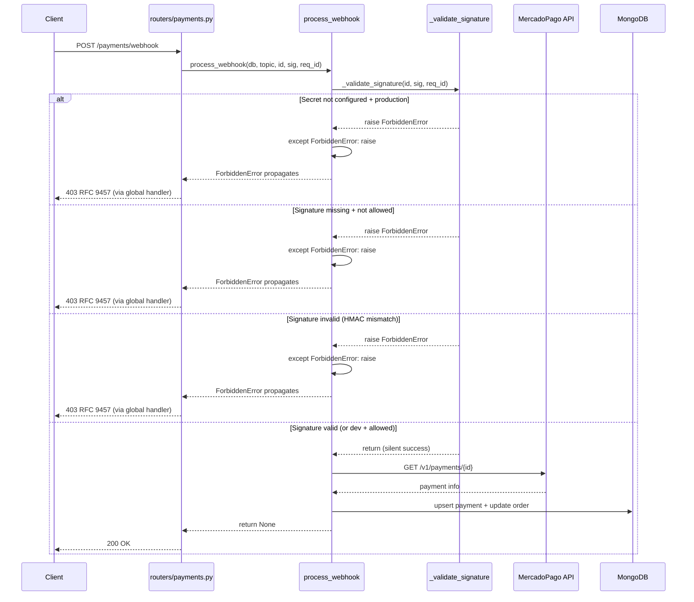

# Design: Webhook Signature Enforcement + Dead-Code Backdoor Removal

## 1. Overview

Two CRITICAL audit findings fixed in ~75 lines across four files:

- **F-001**: `_validate_signature` in `services/payments.py` becomes blocking — raises `ForbiddenError` on invalid/missing signature. `process_webhook` restructured so the error escapes its catch-all `except Exception`.
- **F-003**: `authenticate_user` (hardcoded admin backdoor) deleted from `security.py`.

**Sources**: [Proposal](../proposal.md) · [Spec](../specs/service-layer/spec.md) · [Audit](../../audits/security-audit-2026-06-15.md) · Engram #267, #268, obs-0fd556c8956eb008.

---

## 2. Architecture Decisions

### ADR-1: Raise `ForbiddenError` (domain exception) vs `HTTPException(403)`

| Option | Tradeoff |
|--------|----------|
| **`ForbiddenError`** (chosen) | Integrates with existing `ServiceError` → RFC 9457 handler in `utils/errors.py`. Consistent with how `services/payments.py:63` and `services/orders.py:135,148` already handle auth failures. Test coverage already exists (`test_problem_details.py:119`). |
| `HTTPException(403)` directly | Bypasses the RFC 9457 normalization layer. Inconsistent with the rest of the service layer contract. |
| Custom new exception | Unnecessary — `ForbiddenError` already carries `status_code=403, code="forbidden"`. |

**Decision**: Use `ForbiddenError` from `services/exceptions.py` — already imported at `services/payments.py:25`.

### ADR-2: Explicit `except ForbiddenError: raise` before the catch-all

| Option | Tradeoff |
|--------|----------|
| **(a) `except ForbiddenError: raise` before `except Exception`** (chosen) | Minimal blast radius. One line added. Rest of the function unchanged. Same pattern already used in `create_mp_preference` (`services/payments.py:102-103`). |
| (b) Narrow the catch-all to Motor/DB errors only | More correct but changes ~30 lines of error handling. Risk of missing an edge case. Better done in a separate refactor. |
| (c) Full restructure with typed exceptions | Ideal long-term, but outside scope of this security fix. Spec explicitly says "minimal blast radius." |

**Decision**: Option (a). Add `except ForbiddenError: raise` at line 180, before `except Exception`. This mirrors the existing pattern at line 102-103.

### ADR-3: `MERCADOPAGO_ALLOW_UNSIGNED_WEBHOOKS` env var (default `false`)

| Option | Tradeoff |
|--------|----------|
| **Env var, default `false`** (chosen) | Safe by default. Devs opt in for MP test-panel. Zero production risk. |
| Always require signature, no escape hatch | Most secure, but blocks a real dev tool (MP dashboard test-panel sends unsigned webhooks — documented behavior). |
| Default `true` in dev, `false` in prod | Environment-dependent defaults are fragile. Prefer explicit opt-in. |

**Decision**: Add `MERCADOPAGO_ALLOW_UNSIGNED_WEBHOOKS: bool = False` to `config.py`. `_validate_signature` checks it only when `ENV != "production"` and signature is missing.

### ADR-4: Test fixtures for removed `authenticate_user`

| Option | Tradeoff |
|--------|----------|
| **`tests/conftest.py` with `auth_user_dep`/`auth_admin_dep`** (chosen) | Already exists. No new fixture needed. The existing `_make_user_token_data` helper generates strong fake IDs. No `123456` anywhere. |
| New `tests/fixtures/auth.py` | Unnecessary — conftest already covers auth mocking. |
| No fixture | Risk of future dev creating a new backdoor for convenience. |

**Decision**: No work needed. `tests/conftest.py` already provides `auth_user_dep` and `auth_admin_dep` with non-trivial tokens. The grep confirms zero imports of `authenticate_user` outside `security.py` itself.

---

## 3. Sequence Diagram — Webhook Flow



Key: The `except ForbiddenError: raise` at line 180 is hit **before** the `except Exception` handler, so the error propagates untouched. The `except Exception` catch-all still handles unexpected errors (Motor timeouts, MP API failures) as before.

---

## 4. Implementation Outline

### 4.1 `services/payments.py` — F-001

**`_validate_signature` (lines 189–222)** — rewrite to three branches:

| Branch | Condition | Action |
|--------|-----------|--------|
| 1 | `MERCADOPAGO_WEBHOOK_SECRET` not configured AND `ENV=production` | `raise ForbiddenError("Webhook secret not configured in production.")` |
| 2 | `ENV != production` AND `MERCADOPAGO_ALLOW_UNSIGNED_WEBHOOKS=false` AND no `x-signature` header | `raise ForbiddenError("Missing webhook signature.")` |
| 3 | `x-signature` present but HMAC mismatch / missing `ts`/`v1` | `raise ForbiddenError("Invalid webhook signature.")` |
| 4 | Valid signature | return silently (no log change needed — keep logger.info on success) |

The existing `except Exception` at line 221–222 (catches parse errors in the `parts` dict) becomes the innermost handler for signature parsing failures — raise `ForbiddenError` there too.

**`process_webhook` (line 180)** — insert before the catch-all:

```python
except ForbiddenError:
    raise
except Exception as exc:
    logger.error(...)
```

The `_validate_signature` call at line 120 stays in place. The explicit re-raise ensures `ForbiddenError` propagates past the `except Exception` at line 180.

### 4.2 `config.py` — New env var

Add to `Settings` class (after `MERCADOPAGO_WEBHOOK_SECRET`):

```python
MERCADOPAGO_ALLOW_UNSIGNED_WEBHOOKS: bool = False
```

Document in `.env.example` under the Mercado Pago section.

### 4.3 `security.py` — F-003

**Delete lines 148–175** (the entire `authenticate_user` function).

**Remove `UserLogin` from the import** at line 8 — it was only used by `authenticate_user`. The import becomes:

```python
from models import TokenData, UserRole
```

No other code in `security.py` references `UserLogin`. The routers import `UserLogin` directly from `models` (e.g., `routers/auth.py:10`).

### 4.4 `tests/` — New tests

Add to `tests/` (new file `tests/test_webhook_security.py` or inline in existing test):

| Test | Method | What it verifies |
|------|--------|-----------------|
| `test_invalid_signature_returns_403` | Integration (test_client) | POST with bad x-signature → 403 + RFC 9457 body |
| `test_missing_signature_production_403` | Unit (mock settings) | ENV=production, no MERCADOPAGO_WEBHOOK_SECRET → ForbiddenError |
| `test_valid_signature_succeeds` | Unit (mock HMAC) | Correct HMAC → no exception raised |
| `test_authenticate_user_not_imported` | grep in CI | Not a pytest test — CI step: `rg "authenticate_user" --include="*.py" | grep -v security.py` |

Test fixtures available: `test_app`, `test_client`, `test_db`, `monkeypatch` (for settings mocks). The `silence_side_effects` autouse fixture prevents real audit/email side effects.

### 4.5 `.env.example` — Documentation

Add after `MERCADOPAGO_WEBHOOK_SECRET`:

```text
# OPTIONAL. Allow webhooks without x-signature header in development
# (needed for MercadoPago test-panel). Default: false. Ignored in production.
MERCADOPAGO_ALLOW_UNSIGNED_WEBHOOKS=false
```

---

## 5. Test Strategy

| Layer | What to Test | Approach |
|-------|-------------|----------|
| **Unit** | `_validate_signature` branches | Patch `settings.MERCADOPAGO_WEBHOOK_SECRET` and `settings.ENV` via `monkeypatch`. Mock `hmac.compare_digest` to control pass/fail. Assert `ForbiddenError` raised or not. |
| **Unit** | `ForbiddenError` re-raise in `process_webhook` | Mock `_validate_signature` to raise `ForbiddenError`. Assert error propagates (not caught by `except Exception`). |
| **Integration** | Webhook endpoint → 403 | Mount `routers/payments.router` on `test_app`. POST with bad `x-signature` header. Assert `response.status_code == 403` and `Content-Type: application/problem+json`. |
| **Configuration** | Production without secret rejects | Monkeypatch `settings.ENV = "production"` and `settings.MERCADOPAGO_WEBHOOK_SECRET = None`. Assert `ForbiddenError`. |
| **Regression** | No `authenticate_user` imports | CI step: `rg "authenticate_user" --include="*.py" --glob="!security.py"`. Must return zero matches. |
| **Regression** | No `admin@example.com` in source | CI step: `rg "admin@example.com" --include="*.py" --glob="!tests/*"`. Must return zero matches. |
| **Regression** | Existing test suite passes | `pytest --maxfail=1 --tb=short` — all 100+ existing tests must pass. |

---

## 6. Rollout & Rollback

- **Deploy**: Single PR, standard pipeline.
- **No data migration**: Pure code change, no DB schema changes.
- **No feature flags needed**: `MERCADOPAGO_ALLOW_UNSIGNED_WEBHOOKS` is the only toggle, default `false`.
- **Rollback**: `git revert <commit>`. Both changes are isolated to `services/payments.py` + `security.py` + `config.py`. No shared state.
- **Post-deploy verification**: Send a signed webhook to confirm valid ones still work. Send an unsigned one to confirm 403.

---

## 7. Open Questions

- **MP test-panel webhooks** (carry-over from spec/discovery): The safe default (`MERCADOPAGO_ALLOW_UNSIGNED_WEBHOOKS=false`) is implemented. The user will revisit whether dev should default to `true` after the 6-PR plan completes. Documented in ADR-3 above.
- **`UserLogin` model**: Still used by `routers/auth.py` for the login endpoint. No removal needed — only the `security.py` import is cleaned up.
