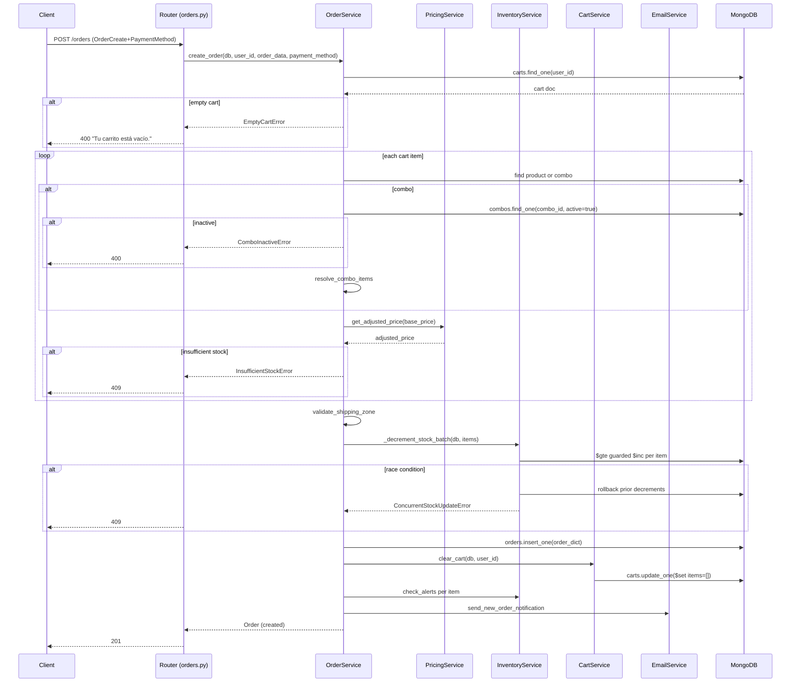
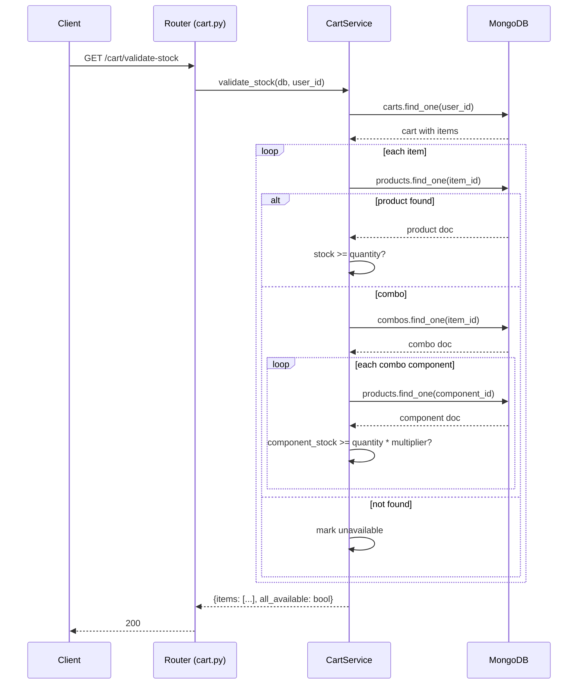
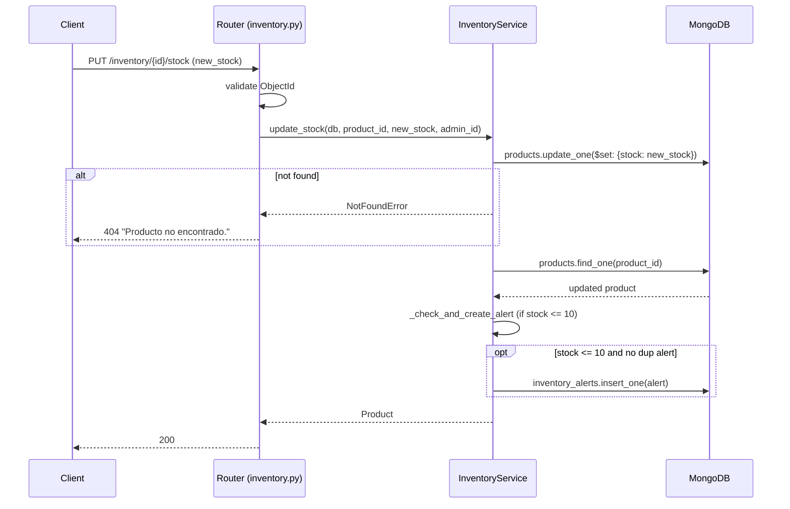

# Design: Service Layer

## 1. Architecture Overview

```
HTTP Request
    │
    ▼
┌─────────────────────────────────────┐
│  Router (thin HTTP adapter)         │
│  - parse Pydantic input             │
│  - call service function            │
│  - catch domain exceptions          │
│  - translate to HTTPException        │
│  - serialize return value            │
└──────────────┬──────────────────────┘
               │ async call (passes AsyncIOMotorDatabase)
               ▼
┌─────────────────────────────────────┐
│  Service module (async functions)   │
│  - business logic                   │
│  - multi-collection orchestration   │
│  - raises domain exceptions         │
│  - returns Pydantic models / dicts  │
└──────────────┬──────────────────────┘
               │ db["collection_name"]
               ▼
┌─────────────────────────────────────┐
│  Motor → MongoDB                    │
│  db.products, db.orders, db.carts…  │
└─────────────────────────────────────┘
```

**What moves**: Stock math, price calculation, combo resolution, cart operations, order orchestration (stock check → decrement → cart clear → email → alerts), shipping config, payment webhook handling, product catalog queries, alert generation. All of it moves from `routers/` to `services/`.

**What stays in routers**: Pydantic validation (automatic via FastAPI param annotations), auth guard invocation (`Depends(get_current_admin_user)`), the `try/except` block that translates domain exceptions to `HTTPException`, and return serialization (`response_model`). Routers keep their `POST /path` structure; they just become thinner.

**What stays outside both**: `models.py` (unchanged), `database.py` (unchanged pattern — `get_database` dep), `security.py` (unchanged deps), `pricing_helpers.py` (consumed by `services/pricing.py`), `email_service.py` (consumed by `services/orders.py`).

## 2. Service Module Public API

All functions are `async`, receive `db: AsyncIOMotorDatabase` as first data param, return Pydantic models or domain dicts, and raise exceptions from `services/exceptions.py`.

### 2.1 services/inventory.py

| Public function | Signature | Returns | Domain exceptions |
|---|---|---|---|
| `update_stock` | `async def update_stock(db: AsyncIOMotorDatabase, product_id: str, new_stock: int, admin_user_id: str) -> Product` | `Product` | `ValidationError` (bad ObjectId), `NotFoundError` |
| `add_stock` | `async def add_stock(db: AsyncIOMotorDatabase, product_id: str, quantity: int, admin_user_id: str) -> Product` | `Product` | `ValidationError`, `NotFoundError` |
| `get_alerts` | `async def get_alerts(db: AsyncIOMotorDatabase, limit: int = 100) -> list[InventoryAlert]` | `list[InventoryAlert]` | — |

**Private helpers**: `_check_and_create_alert(db, product_id)` (moved from `routers/inventory.py`), `_LOW_STOCK_THRESHOLD = 10`.

**External dependencies**: none.

### 2.2 services/pricing.py

| Public function | Signature | Returns | Domain exceptions |
|---|---|---|---|
| `get_settings` | `async def get_settings(db: AsyncIOMotorDatabase) -> DynamicPricingSettings` | `DynamicPricingSettings` | — |
| `update_settings` | `async def update_settings(db: AsyncIOMotorDatabase, update: DynamicPricingUpdate, admin_user_id: str) -> DynamicPricingSettings` | `DynamicPricingSettings` | — |
| `get_adjusted_price` | `async def get_adjusted_price(db: AsyncIOMotorDatabase, base_price: float) -> float` | `float` | — |

**Private helpers**: `_is_active(settings, current_time)` — static logic from `pricing_helpers.py` (refactored in-place or imported).

**External dependencies**: `pricing_helpers.py` (consumes `is_dynamic_pricing_active` and `get_adjusted_price`; `services/pricing.py` calls them directly, no import change needed).

### 2.3 services/cart.py

| Public function | Signature | Returns | Domain exceptions |
|---|---|---|---|
| `get_cart_detailed` | `async def get_cart_detailed(db: AsyncIOMotorDatabase, user_id: str) -> CartDetailed` | `CartDetailed` | — |
| `add_item` | `async def add_item(db: AsyncIOMotorDatabase, user_id: str, item: CartItem) -> Cart` | `Cart` | `ValidationError`, `NotFoundError` (product/combo), `InsufficientStockError` |
| `update_item` | `async def update_item(db: AsyncIOMotorDatabase, user_id: str, item: CartItem) -> Cart` | `Cart` | `ValidationError`, `NotFoundError`, `InsufficientStockError`, `CartItemNotFoundError` |
| `remove_item` | `async def remove_item(db: AsyncIOMotorDatabase, user_id: str, product_id: str) -> Cart` | `Cart` | `ValidationError`, `CartItemNotFoundError` |
| `cleanup` | `async def cleanup_cart(db: AsyncIOMotorDatabase, user_id: str) -> dict` | `dict` (cart + removed_items) | — |
| `validate_stock` | `async def validate_stock(db: AsyncIOMotorDatabase, user_id: str) -> dict` | `dict` (items + all_available) | — |
| `clear` | `async def clear_cart(db: AsyncIOMotorDatabase, user_id: str) -> Cart` | `Cart` | — |

**Private helpers**: `_get_or_create_cart(db, user_id) -> Cart`, `_save_cart(db, cart) -> Cart`, `_resolve_item_type(db, product_id) -> tuple[bool, dict|None]`, `_validate_product_stock(db, product_id, quantity) -> None`, `_validate_combo_stock(db, combo_id, quantity) -> None`.

**External dependencies**: `services/pricing.py` (if cart adds price enrichment), though current cart price enrichment happens in `get_cart_detailed` via direct product lookup — pricing is a separate concern for `services/products.py`.

### 2.4 services/combos.py

| Public function | Signature | Returns | Domain exceptions |
|---|---|---|---|
| `get_active` | `async def get_active(db: AsyncIOMotorDatabase) -> list[ComboDetailed]` | `list[ComboDetailed]` | — |
| `get_by_id` | `async def get_by_id(db: AsyncIOMotorDatabase, combo_id: str) -> Combo` | `Combo` | `ValidationError`, `NotFoundError` |
| `create` | `async def create_combo(db: AsyncIOMotorDatabase, combo_data: ComboCreate, admin_user_id: str) -> Combo` | `Combo` | `ValidationError`, `NotFoundError` (product refs) |
| `update` | `async def update_combo(db: AsyncIOMotorDatabase, combo_id: str, combo_data: ComboUpdate, admin_user_id: str) -> Combo` | `Combo` | `ValidationError`, `NotFoundError` |
| `delete` | `async def delete_combo(db: AsyncIOMotorDatabase, combo_id: str, permanent: bool, admin_user_id: str) -> dict` | `dict` | `ValidationError`, `NotFoundError` |
| `get_all_admin` | `async def get_all_admin(db: AsyncIOMotorDatabase, include_inactive: bool) -> list[ComboDetailed]` | `list[ComboDetailed]` | — |

**Private helpers**: `_enrich_combos(db, combo_docs) -> list[ComboDetailed]`, `_bulk_load_products(db, product_ids) -> dict`.

**External dependencies**: `services/pricing.py` (for `get_adjusted_price` on combo prices).

### 2.5 services/orders.py

| Public function | Signature | Returns | Domain exceptions |
|---|---|---|---|
| `create_order` | `async def create_order(db: AsyncIOMotorDatabase, user_id: str, order_data: OrderCreate, payment_method: PaymentMethod) -> Order` | `Order` | `EmptyCartError`, `NotFoundError`, `InsufficientStockError`, `ComboInactiveError`, `ShippingZoneInvalidError`, `ShippingZoneDisabledError`, `ConcurrentStockUpdateError`, `InternalError` |
| `get_my_orders` | `async def get_my_orders(db: AsyncIOMotorDatabase, user_id: str, limit: int = 50, skip: int = 0) -> list[Order]` | `list[Order]` | — |
| `get_order_details` | `async def get_order_details(db: AsyncIOMotorDatabase, user_id: str, order_id: str) -> Order` | `Order` | `ValidationError`, `NotFoundError`, `ForbiddenError` |
| `select_payment_method` | `async def select_payment_method(db: AsyncIOMotorDatabase, user_id: str, order_id: str, payment_method: PaymentMethod) -> Order` | `Order` | `ValidationError`, `NotFoundError`, `ForbiddenError`, `InvalidStateTransitionError` |
| `update_status_admin` | `async def update_status_admin(db: AsyncIOMotorDatabase, order_id: str, new_status: OrderStatus, admin_user_id: str) -> Order` | `Order` | `ValidationError`, `NotFoundError` |
| `get_shipping_prices` | `async def get_shipping_prices(db: AsyncIOMotorDatabase) -> dict` | `dict` | — |

**Private helpers**: `_process_combo_item(db, combo_id, quantity) -> dict`, `_compute_shipping_cost(db, zone, total_items, has_combo) -> float`, `_decrement_stock_batch(db, items) -> None`, `_rollback_stock_batch(db, items) -> None`, `_build_order_items(db, cart_items, pricing_settings) -> tuple[list[OrderItem], float, list[dict]]`, `_restock_order_items(db, items) -> None`.

**External dependencies**: `services/inventory.py` (alert check), `services/pricing.py` (adjusted prices), `services/cart.py` (`clear`), `email_service.py` (`send_new_order_notification`).

### 2.6 services/payments.py

| Public function | Signature | Returns | Domain exceptions |
|---|---|---|---|
| `create_preference` | `async def create_preference(db: AsyncIOMotorDatabase, user_id: str, order_id: str) -> dict` | `dict` (preference_id + init_point) | `ValidationError`, `NotFoundError`, `ForbiddenError`, `InvalidStateTransitionError` |
| `handle_webhook` | `async def handle_webhook(db: AsyncIOMotorDatabase, request: Request) -> Response` | `Response(200)` | — (logs errors, always returns 200) |

**Private helpers**: `_validate_signature(request, secret) -> bool`, `_map_payment_status_to_order(payment_status) -> OrderStatus|None`.

**External dependencies**: `mercadopago.SDK` (same singleton as today), `services/orders.py` (none — payment service updates orders collection directly within its scope; order status mapping is payment service responsibility).

### 2.7 services/shipping.py

| Public function | Signature | Returns | Domain exceptions |
|---|---|---|---|
| `get_prices` | `async def get_prices(db: AsyncIOMotorDatabase) -> dict` | `dict` (zone → price/description/enabled) | — |

**Note**: This is a thin extract of the `GET /shipping-prices` endpoint from `routers/orders.py`. It does NOT raise domain exceptions — the current handler returns defaults on any error.

**Private helpers**: `_default_prices() -> dict`.

**External dependencies**: none.

### 2.8 services/products.py

| Public function | Signature | Returns | Domain exceptions |
|---|---|---|---|
| `list_public` | `async def list_public(db: AsyncIOMotorDatabase, category: str|None, min_price: float|None, max_price: float|None, search: str|None, include_out_of_stock: bool, page: int, page_size: int) -> dict` | `dict` (items + meta) | — |
| `get_public` | `async def get_public(db: AsyncIOMotorDatabase, product_id: str) -> Product` | `Product` | `ValidationError`, `NotFoundError` |
| `create_admin` | `async def create_product(db: AsyncIOMotorDatabase, product: AdminProduct, admin_user_id: str) -> AdminProduct` | `AdminProduct` | `DuplicateProductNameError`, `InternalError` |
| `update_admin` | `async def update_product(db: AsyncIOMotorDatabase, product_id: str, update: ProductUpdate, admin_user_id: str) -> AdminProduct` | `AdminProduct` | `ValidationError`, `NotFoundError` |
| `delete_admin` | `async def delete_product(db: AsyncIOMotorDatabase, product_id: str, admin_user_id: str) -> None` | `None` (204) | `ValidationError`, `NotFoundError` |
| `toggle_active` | `async def toggle_active(db: AsyncIOMotorDatabase, product_id: str, admin_user_id: str) -> AdminProduct` | `AdminProduct` | `ValidationError`, `NotFoundError` |

**Private helpers**: `_build_product_query(category, min_price, max_price, search, include_out_of_stock) -> dict`, `_apply_dynamic_pricing(product, pricing_settings) -> Product`.

**External dependencies**: `services/pricing.py` (`get_adjusted_price`, `get_settings`).

### 2.9 services/exceptions.py

All domain exceptions live here. See Section 4 for the full class tree and translation map.

## 3. Dependency Injection Pattern

Routers keep their `Depends(get_database)` dependency to obtain `db: AsyncIOMotorDatabase`. They pass `db` as the first data argument to service functions. Services derive collections internally via `db["collection_name"]`.

### Worked example: `PUT /inventory/{id}/stock`

**BEFORE** (current `routers/inventory.py`, lines 52–79):

```python
@router.put("/{product_id}/stock", response_model=Product)
async def update_product_stock(
    product_id: str,
    new_stock: int = Body(..., embed=True, ge=0),
    products_collection = Depends(get_products_collection),
    alerts_collection = Depends(get_alerts_collection),
    current_admin_user: TokenData = Depends(get_current_admin_user)
):
    if not ObjectId.is_valid(product_id):
        raise HTTPException(status_code=status.HTTP_400_BAD_REQUEST, detail="ID de producto inválido.")
    result = await products_collection.update_one(
        {"_id": ObjectId(product_id)},
        {"$set": {"stock": new_stock}}
    )
    if result.matched_count == 0:
        raise HTTPException(status_code=status.HTTP_404_NOT_FOUND, detail="Producto no encontrado.")
    await check_and_create_alert(products_collection, alerts_collection, product_id)
    updated_product = await products_collection.find_one({"_id": ObjectId(product_id)})
    logger.info(...)
    return Product(**updated_product)
```

**AFTER** (same endpoint, thin router):

```python
from services.inventory import update_stock
from services.exceptions import NotFoundError, ValidationError

@router.put("/{product_id}/stock", response_model=Product)
async def update_product_stock(
    product_id: str,
    new_stock: int = Body(..., embed=True, ge=0),
    db: AsyncIOMotorDatabase = Depends(get_database),  # ← only one DB dep
    current_admin_user: TokenData = Depends(get_current_admin_user)
):
    if not ObjectId.is_valid(product_id):
        raise HTTPException(status_code=status.HTTP_400_BAD_REQUEST, detail="ID de producto inválido.")
    try:
        return await update_stock(db, product_id, new_stock, current_admin_user.user_id)
    except NotFoundError:
        raise HTTPException(status_code=status.HTTP_404_NOT_FOUND, detail="Producto no encontrado.")
    # ValidationError for ObjectId handled above; no catch needed here
```

Key changes:
- `get_products_collection` and `get_alerts_collection` deps removed → single `db = Depends(get_database)`.
- `check_and_create_alert` call moved into `services/inventory.py`.
- `update_stock` signature: `(db, product_id, new_stock, admin_user_id) -> Product`.
- The ObjectId validation stays in the router (pure input validation, no DB access).

## 4. Domain Exception Hierarchy and Translation Map

### Class tree

```
ServiceError (Exception)                    ← base, code="internal_error", status=500
├── NotFoundError                          ← code="not_found", status=404
│   ├── ProductNotFoundError
│   ├── ComboNotFoundError
│   ├── OrderNotFoundError
│   └── CartItemNotFoundError
├── ValidationError                        ← code="validation_error", status=400
│   └── InvalidObjectIdError
├── InsufficientStockError                 ← code="insufficient_stock", status=409
├── ConcurrentStockUpdateError             ← code="concurrent_stock_update", status=409
├── InvalidStateTransitionError            ← code="invalid_state_transition", status=409
├── ConflictError                          ← code="conflict", status=409
│   └── DuplicateProductNameError
├── ComboInactiveError                     ← code="combo_inactive", status=400
├── EmptyCartError                         ← code="empty_cart", status=400
├── ForbiddenError                         ← code="forbidden", status=403
├── ShippingZoneError                      ← code="shipping_zone_error", status=400
│   ├── ShippingZoneInvalidError
│   └── ShippingZoneDisabledError
└── InternalError                          ← code="internal_error", status=500
```

Every exception carries: `status_code: int` (HTTP hint), `code: str` (machine-readable), `detail: str` (human-readable). The router uses `e.status_code` for `HTTPException(status_code=e.status_code, detail=e.detail)`.

### Translation Map (≥15 rows, grounded in actual router HTTPException calls)

| # | Domain exception raised by service | Router catches & translates to | Source router (line) |
|---|---|---|---|
| 1 | `ValidationError("ID de producto inválido.")` | `HTTPException(400, "ID de producto inválido.")` | `inventory.py:64` |
| 2 | `NotFoundError("Producto no encontrado.")` | `HTTPException(404, "Producto no encontrado.")` | `inventory.py:72` |
| 3 | `NotFoundError("Producto o combo no encontrado.")` | `HTTPException(404, "Producto o combo no encontrado.")` | `cart.py:197` |
| 4 | `NotFoundError("Pedido no encontrado.")` | `HTTPException(404, "Pedido no encontrado.")` | `orders.py:549` |
| 5 | `NotFoundError("Combo no encontrado.")` | `HTTPException(404, "Combo no encontrado.")` | `combos.py:137` |
| 6 | `CartItemNotFoundError("El producto/combo no está en el carrito.")` | `HTTPException(404, "El producto/combo no está en el carrito.")` | `cart.py:336` |
| 7 | `CartItemNotFoundError("El producto no está en el carrito.")` | `HTTPException(404, "El producto no está en el carrito.")` | `cart.py:365` |
| 8 | `NotFoundError(f"Producto {pid} del combo no encontrado.")` | `HTTPException(404, f"Producto {pid} del combo no encontrado.")` | `orders.py:70` |
| 9 | `EmptyCartError("Tu carrito está vacío.")` | `HTTPException(400, "Tu carrito está vacío.")` | `orders.py:204` |
| 10 | `InsufficientStockError(f"Stock insuficiente para '{name}'. Disponible: {avail}, Solicitado: {req}.")` | `HTTPException(409, f"Stock insuficiente para '{name}'. Disponible: {avail}, Solicitado: {req}.")` | `orders.py:268` |
| 11 | `InsufficientStockError(f"Stock insuficiente para '{name}' (parte del combo '{combo}'). Disponible: {avail}, Necesario: {need}.")` | `HTTPException(409, f"Stock insuficiente para '{name}' (parte del combo '{combo}'). Disponible: {avail}, Necesario: {need}.")` | `orders.py:78` |
| 12 | `ConcurrentStockUpdateError(f"Stock insuficiente para '{name}' debido a una compra concurrente. Por favor, intentá nuevamente.")` | `HTTPException(409, f"Stock insuficiente para '{name}' debido a una compra concurrente. Por favor, intentá nuevamente.")` | `orders.py:379` |
| 13 | `ComboInactiveError(f"El combo '{name}' ya no está disponible. Por favor, elimínalo de tu carrito antes de continuar.")` | `HTTPException(400, f"El combo '{name}' ya no está disponible. Por favor, elimínalo de tu carrito antes de continuar.")` | `orders.py:235` |
| 14 | `InvalidStateTransitionError(f"No se puede cambiar el método de pago. El pedido está en estado '{status}'.")` | `HTTPException(409, f"No se puede cambiar el método de pago. El pedido está en estado '{status}'.")` | `orders.py:558` |
| 15 | `InvalidStateTransitionError("Este pedido ya ha sido procesado o cancelado.")` | `HTTPException(409, "Este pedido ya ha sido procesado o cancelado.")` | `payments.py:47` |
| 16 | `ForbiddenError("Este pedido no te pertenece.")` | `HTTPException(403, "Este pedido no te pertenece.")` | `orders.py:553` |
| 17 | `ForbiddenError("No tienes permiso para ver este pedido.")` | `HTTPException(403, "No tienes permiso para ver este pedido.")` | `orders.py:597` |
| 18 | `ShippingZoneInvalidError("Zona de envío inválida. Debe ser 'central', 'remote' o 'pickup'.")` | `HTTPException(400, "Zona de envío inválida. Debe ser 'central', 'remote' o 'pickup'.")` | `orders.py:291` |
| 19 | `ShippingZoneDisabledError(f"{zone_name} no está disponible actualmente. Por favor, selecciona otra opción de envío.")` | `HTTPException(400, f"{zone_name} no está disponible actualmente. Por favor, selecciona otra opción de envío.")` | `orders.py:314` |
| 20 | `DuplicateProductNameError("El nombre del producto ya existe.")` | `HTTPException(409, "El nombre del producto ya existe.")` | `products.py:38` |
| 21 | `NotFoundError("Producto no encontrado para eliminar.")` | `HTTPException(404, "Producto no encontrado para eliminar.")` | `products.py:238` |
| 22 | `InternalError("No se pudo crear el producto.")` | `HTTPException(500, "No se pudo crear el producto.")` | `products.py:45` |
| 23 | `InternalError("No se pudo crear el pedido.")` | `HTTPException(500, "No se pudo crear el pedido.")` | `orders.py:393` |

### Worked router `try/except` block (from `routers/orders.py` after refactor)

```python
from services.orders import create_order
from services.exceptions import (
    EmptyCartError, NotFoundError, InsufficientStockError,
    ComboInactiveError, ShippingZoneInvalidError,
    ShippingZoneDisabledError, ConcurrentStockUpdateError
)

@router.post("/", response_model=Order, status_code=status.HTTP_201_CREATED)
async def create_order_endpoint(
    order_data: OrderCreate,
    payment_method: PaymentMethod = PaymentMethod.MERCADO_PAGO,
    user_id: str = Depends(get_current_active_user_id),
    db: AsyncIOMotorDatabase = Depends(get_database),
    current_verified_user: TokenData = Depends(get_current_verified_user)
):
    try:
        return await create_order(db, user_id, order_data, payment_method)
    except EmptyCartError as e:
        raise HTTPException(status_code=e.status_code, detail=e.detail)
    except NotFoundError as e:
        raise HTTPException(status_code=e.status_code, detail=e.detail)
    except InsufficientStockError as e:
        raise HTTPException(status_code=e.status_code, detail=e.detail)
    except ComboInactiveError as e:
        raise HTTPException(status_code=e.status_code, detail=e.detail)
    except ShippingZoneInvalidError as e:
        raise HTTPException(status_code=e.status_code, detail=e.detail)
    except ShippingZoneDisabledError as e:
        raise HTTPException(status_code=e.status_code, detail=e.detail)
    except ConcurrentStockUpdateError as e:
        raise HTTPException(status_code=e.status_code, detail=e.detail)
    except InternalError as e:
        raise HTTPException(status_code=e.status_code, detail=e.detail)
```

Note: many exceptions share parent classes (`NotFoundError` catches all 404 subclasses, `ValidationError` catches all 400 subclasses). Routers can use parent-class catches to keep the `try/except` compact when the translated `status_code` is the same.

## 5. Sequence Diagrams

### 5.1 Order creation (`POST /orders`)



### 5.2 Cart stock validation (`GET /cart/validate-stock`)



### 5.3 Inventory stock update (`PUT /inventory/{id}/stock`)



### 5.4 Payment webhook (`POST /payments/webhook`)

```mermaid
sequenceDiagram
    participant MP as Mercado Pago
    participant R as Router (payments.py)
    participant PS as PaymentService
    participant DB as MongoDB

    MP->>R: POST /payments/webhook (topic=payment, id=X)
    R->>PS: handle_webhook(db, request)
    PS->>PS: validate_signature(x-signature, request-id, data.id)
    Note over PS: HMAC-SHA256; non-blocking in testing
    PS->>DB: payments.find_one({id: payment_id})
    alt already processed (idempotency)
        DB-->>PS: existing payment
        PS-->>R: 200 OK (ignore)
        R-->>MP: 200 OK
    end
    PS->>MP: SDK.payment().get(payment_id)
    MP-->>PS: payment_info (status, external_reference)
    PS->>DB: payments.insert_one(payment_info)
    PS->>DB: orders.find_one(external_reference)
    DB-->>PS: order doc
    alt payment approved + order PENDING
        PS->>DB: orders.update_one($set: status=PROCESSING)
    else payment rejected/cancelled
        PS->>DB: orders.update_one($set: status=CANCELLED)
    else payment in_process
        PS->>DB: orders.update_one($set: payment_status=in_process)
    end
    PS-->>R: Response(200)
    R-->>MP: 200 OK
```

## 6. Slice Delivery Plan

### Pre-cleanup: PR #0

| Aspect | Detail |
|---|---|
| **Delete** | `routers/orders_backup.py` (422 LOC dead code, bug present) |
| **Verify** | `pytest` still passes; 12 test files don't import it |
| **LOC** | ~-422 (exempt from 400-LOC budget) |

### Slice 1: Inventory (~160 LOC)

| Aspect | Detail |
|---|---|
| **Create** | `services/__init__.py`, `services/exceptions.py` (base tree: `ServiceError`, `NotFoundError`, `ValidationError`, `InsufficientStockError`, `InternalError`), `services/inventory.py` |
| **Modify** | `routers/inventory.py` (remove `check_and_create_alert`, `get_products_collection`, `get_alerts_collection`; 3 endpoints → thin) |
| **New exceptions** | `ServiceError`, `NotFoundError`, `ValidationError`, `InternalError` |
| **LOC** | ~160 total (~80 new service + exceptions, ~80 removed from router) |
| **Test impact** | `tests/test_inventory.py`, `tests/test_inventory_alerts_integration.py` — fixture overrides only; `dependency_overrides` for `services.inventory.*` if needed, or mock DB with `reset_db_singleton` unchanged |
| **Verify** | `curl PUT /inventory/{id}/stock`, `curl PUT /inventory/{id}/stock/add`, `curl GET /inventory/alerts` |

### Slice 2: Pricing (~180 LOC)

| Aspect | Detail |
|---|---|
| **Create** | `services/pricing.py` |
| **Modify** | `routers/pricing_settings.py` (3 endpoints → thin), `routers/products.py` (remove `get_pricing_settings_collection` import; call `services/pricing.get_adjusted_price` instead of `pricing_helpers.get_adjusted_price` directly) |
| **New exceptions** | None (uses existing from Slice 1) |
| **LOC** | ~180 total (~70 service, ~50 router reductions in pricing_settings, ~60 router reductions in products) |
| **Test impact** | `tests/test_products_filter.py` — fixture tweaks for `dependency_overrides` on `services.pricing.*` |
| **Verify** | `curl GET /pricing-settings`, `curl GET /products`, `curl GET /products/{id}` — dynamic pricing still applied |

### Slice 3: Cart (+ thin Product/Combo service stubs) (~290 LOC)

| Aspect | Detail |
|---|---|
| **Create** | `services/cart.py`, `services/products.py` (public-facing functions), `services/combos.py` (public-facing functions) |
| **Modify** | `routers/cart.py` (7 endpoints → thin), `routers/products.py` (public endpoints → thin), `routers/combos.py` (public endpoints → thin) |
| **New exceptions** | `CartItemNotFoundError`, `InsufficientStockError`, `ComboInactiveError` (added to `exceptions.py`) |
| **LOC** | ~290 total (~120 new cart + products + combos services, ~170 removed from 3 routers) |
| **Test impact** | `tests/test_cart_stock.py`, `tests/test_products_filter.py`, `tests/test_inventory_alerts_integration.py` — fixture tweaks. Cart tests that mount `routers/cart.py` need `dependency_overrides` for cart service functions |
| **Verify** | `curl POST /cart/add`, `curl GET /cart/validate-stock`, `curl GET /cart/`, `curl DELETE /cart/clear`, `curl POST /cart/cleanup`, `curl GET /products` |

### Slice 4: Orders (+ remaining services) (~350 LOC)

| Aspect | Detail |
|---|---|
| **Create** | `services/orders.py`, `services/payments.py`, `services/shipping.py`; extend `services/combos.py` and `services/products.py` with admin functions; extend `services/exceptions.py` with remaining types |
| **Modify** | `routers/orders.py` (6 endpoints → thin), `routers/payments.py` (2 endpoints → thin), `routers/combos.py` (admin endpoints → thin), `routers/products.py` (admin endpoints → thin) |
| **New exceptions** | `EmptyCartError`, `ConcurrentStockUpdateError`, `InvalidStateTransitionError`, `ForbiddenError`, `ShippingZoneInvalidError`, `ShippingZoneDisabledError`, `DuplicateProductNameError`, `ConflictError` |
| **LOC** | ~350 total (~160 orders service, ~50 payments service, ~30 shipping service, ~50 combos/products admin, ~60 exception additions — balanced by ~200 router reduction) |
| **Test impact** | `tests/test_orders_stock.py`, `tests/test_admin_stats.py` — fixture tweaks. `test_orders_stock.py` must be reviewed carefully (asserts on `/orders/` creation flow). If behavior drifts, PR description MUST call it out |
| **Verify** | Full 6-endpoint smoke: `POST /orders`, `GET /orders/me`, `GET /orders/{id}`, `POST /orders/{id}/select-payment-method`, `PUT /orders/admin/{id}/status`, `POST /payments/webhook` |

## 7. Risk Mitigations

| Risk | Likelihood | Mitigation in design |
|---|---|---|
| Translation byte-identity broken | Medium | Section 4 translation map built by grepping every `HTTPException(status_code=status.` call across all 13 routers (51 matches found). Each row maps exact `detail` string from current code. Implementation MUST use `e.status_code` and `e.detail` from the exception object — never hardcode a new string in the router catch block. |
| Orders slice >400 LOC | Medium | `services/orders.py` is scoped to ~160 lines by keeping `_process_combo_item` and `_decrement_stock_batch` as private helpers inside the service only. The router's 6 endpoints share a single `try/except` block. Payments and shipping are separate service files, not folded into orders. If the diff exceeds 400 after first draft, move `_build_order_items` to a `_order_builder.py` sibling module. |
| Test fixtures break unrelated tests | Low | `conftest.py` already isolates DB via `reset_db_singleton` (monkeypatched in-memory mongomock). Service functions accept `AsyncIOMotorDatabase` — same param type as the DB override. No fixture needs to mock at the module level. Only `dependency_overrides` on `test_app` need updating per slice. Design rule: never mutate `assert` lines; only add `app.dependency_overrides[services.x.func] = lambda: ...` |
| `test_orders_stock.py` assertion drift in Slice 4 | Medium | This test file asserts on the full order creation flow. Since `POST /orders` response shape must be byte-identical, the test assertions MUST NOT change. The design includes Sequence Diagram 5.1 as the canonical flow — implementation must follow it exactly. If a test assertion must change, the PR description calls it out per SDD spec scenario "New failure requires PR description callout." |
| `get_collection` still called from some routers | Low | Slice acceptance criteria: `rg "get_collection\(" routers/<name>.py` returns zero per extracted router. Checked per-slice before merge. |

## 8. Architecture Decision Records

### ADR-1: Modules over classes for services

**Context**: Service layer must expose async functions for business logic. Common patterns include class-based services (with `__init__` for deps) or module-level async functions.

**Decision**: Each service is a **module of async functions**, not a class. The module is the namespace; the `db` is passed as the first data argument to every function.

**Consequences**:
- (+) Zero instantiation overhead; direct import → call.
- (+) No need for DI containers or factory functions.
- (+) Simple to override in tests: `app.dependency_overrides[module.func] = lambda db, *a, **kw: ...`
- (−) No per-request caching (e.g., loading pricing settings once per request). Mitigated: pricing settings are loaded once per order creation anyway (single request scope).

### ADR-2: `AsyncIOMotorDatabase` injection, not collections

**Context**: Current routers inject individual collections (`products_collection`, `carts_collection`, etc.). Services need cross-collection access (orders reads products, carts, combos, pricing, shipping).

**Decision**: Services receive `db: AsyncIOMotorDatabase` and derive collections internally via `db["collection_name"]`. Routers inject `db` via `Depends(get_database)`.

**Consequences**:
- (+) One dependency instead of 5+ per endpoint.
- (+) Future transactions (when MongoDB tier upgrades) can use `db.client.start_session()` without changing service signatures.
- (+) Test override stays simple: `app.dependency_overrides[database.get_database] = lambda: mock_db`.
- (−) Collection names are stringly-typed inside services. Acceptable because MongODB collections are already stringly-typed in the codebase.

### ADR-3: Domain exceptions with HTTP hint codes (not subclassing `HTTPException`)

**Context**: Services must signal domain errors without coupling to HTTP. Options: (a) subclass `HTTPException`, (b) return `Result[T, E]` union types, (c) domain exceptions carrying `status_code` hints.

**Decision**: Domain exceptions carry `status_code: int` (HTTP hint) and `code: str` (stable identifier). Routers catch them and raise `HTTPException(status_code=e.status_code, detail=e.detail)`. Exceptions do NOT subclass `HTTPException`.

**Consequences**:
- (+) Services are HTTP-agnostic — same exception can be mapped differently by a CLI or gRPC layer in the future.
- (+) The `code` field enables future error normalization without changing exception class names.
- (+) Byte-identity is enforced at the router catch site: the `detail` string is copied verbatim from today's `HTTPException` call.
- (−) Routers need a `try/except` block per endpoint. Mitigated by parent-class catches (`except NotFoundError` covers all 404s).

### ADR-4: API 1:1 strictness (no normalization in this change)

**Context**: The current error response shapes are inconsistent (some use 400 for stock, others 409; messages vary). Normalizing them would be a separate behavior change.

**Decision**: This refactor preserves every HTTP response shape byte-for-byte. Error normalization is deferred to a future `normalize-error-responses` change.

**Consequences**:
- (+) Zero user-visible changes. Safe to deploy without frontend coordination.
- (+) Each change does one thing; rollback is per-concern.
- (−) The translation map table (Section 4) is long. Services carry verbose Spanish `detail` strings. Acceptable tradeoff for safety.

### ADR-5: Slice ordering leaf-first by dependency graph

**Context**: 8 service modules must be extracted across 4 PRs ≤400 LOC each. Dependency graph: orders → all others; cart → products, combos; combos → products; products → pricing.

**Decision**: Slice order: Inventory (0 deps) → Pricing (0 deps) → Cart (+ thin products/combos publics) → Orders (+ payments, shipping, remaining admin functions). Each slice leaves the test suite green and all endpoints working.

**Consequences**:
- (+) Slices 1-2 are self-contained and prove the pattern on low-risk modules.
- (+) By Slice 3, the DI pattern and exception handling are battle-tested before tackling orders.
- (−) Slice 4 is the largest and most complex. Mitigated: all cross-service contracts are already established; orders service only orchestrates existing service calls.
- (−) Public product/combos endpoints are thin — extracting them in Slice 3 with cart is a bundling compromise to stay under 400 LOC. Acceptable because they share the same test files and router patterns.
